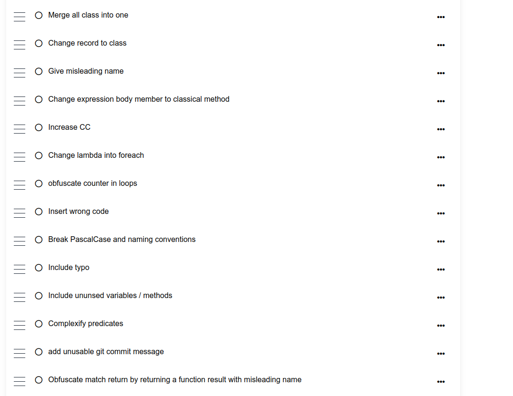

# Crappy Driven Development
This repository contains the code delivered using "Crappy-Driven Development" (CDD) technique during the session of the [Craft Luxembourg Meetup](https://www.meetup.com/fr-FR/software-craft-luxembourg/)

`The secret art of making yourself indispensable by writing crappy code !!!`

[Know more about CDD](cdd.md)

## Starting code
- The team `Crappy Dashboard` has chosen to practice CDD in C# on the [password challenge](https://adventofcode.com/2020/day/2) from the AOC 2020 :

```c#
public record PasswordWithPolicy(string Password, IEnumerable<int> Range, char Letter);

public static class PasswordValidator
{
    private static bool IsValid(PasswordWithPolicy passwordWithPolicy) =>
        passwordWithPolicy.Range
            .Contains(passwordWithPolicy
                .Password
                .Count(p => p == passwordWithPolicy.Letter)
            );

    public static int CountValidPasswords(IEnumerable<string> lines) =>
        lines
            .Select(line => line.ToPasswordWithPolicy())
            .Count(IsValid);
}

public static class StringExtensions
{
    private static readonly Regex PasswordRegex = new(@"(\d+)-(\d+) ([a-z]): ([a-z]+)");
    public static IEnumerable<string> SplitToLines(this string str) => str.Split(Environment.NewLine);

    public static PasswordWithPolicy ToPasswordWithPolicy(this string input) =>
        PasswordRegex.Matches(input)
            .ToList()
            .Select(ToPasswordWithPolicy)
            .Single();

    private static IEnumerable<int> ToRange(Match match)
    {
        var start = int.Parse(match.Groups[1].Value);
        var end = int.Parse(match.Groups[2].Value);

        return Enumerable.Range(start, end - start + 1);
    }

    private static PasswordWithPolicy ToPasswordWithPolicy(Match match) =>
        new PasswordWithPolicy(
            Password: match.Groups[4].Value,
            Range: ToRange(match),
            Letter: match.Groups[3].Value.First());
}
```

- The others have chosen to work on the [Dive kata !](https://adventofcode.com/2021/day/2) in java from the [Advent Of Code 2021](https://adventofcode.com/) :

```java
@Getter
public class Submarine {
    private Position position;

    public Submarine(int horizontal, int depth) {
        this.position = new Position(horizontal, depth);
    }

    public void move(List<Instruction> instructions) {
        instructions.forEach(this::move);
    }

    private void move(Instruction instruction) {
        position = switch (instruction.getText()) {
            case "down" -> position.withDepth(position.getDepth() + instruction.getX());
            case "up" -> position.withDepth(position.getDepth() - instruction.getX());
            default -> position.withHorizontal(position.getHorizontal() + instruction.getX());
        };
    }
}

@AllArgsConstructor
@Getter
public class Instruction {
    private final String text;
    private final int x;

    public static Instruction fromText(String text) {
        var split = text.split(" ");
        return new Instruction(split[0], Integer.parseInt(split[1]));
    }
}

@AllArgsConstructor
@With
@Getter
public class Position {
    private final int horizontal;
    private final int depth;
}
```

## Crappy Dashboard
Crappy techniques used :



```c#
using System.ComponentModel;
using System.Data;
using System.Text.RegularExpressions;

namespace Password;

public static class password_validator
{
    private static readonly Regex weather_forcast = new(@"([0123456789]{1,})-([0123456789]{1,}) ([abcdefghijklmnopqrstuvwxyz]): ([abcdefghijklmnopqrstuvwxyz]{1,})");

    private static bool chang_pass_letter(pwp pwp)
    {
        var b = false;
        foreach (var a in pwp.Range)
        {
            if (a == pwp.Password.Count(p => p == pwp.Letter))
            {
                b = true;
            }
        }
        return b;
    }

    private static pwp contains_policy(Match output)
    {
        return new pwp()
        {
            Password = output.Groups[default(int) + 1 + 1 + 1 + 1].Value,
            Range = password_validator.match(output),
            Letter = output.Groups[default(int) + 1 + 1 + 1 - 1 + 1].Value.ToArray()[default(int)]
        };
    }

    private static IEnumerable<int> match(Match currentState)
    {
        if (int.TryParse(currentState.Groups[default(int) + 1].Value, out int cursor))
        {
            if (int.TryParse(currentState.Groups[default(int) + 1 + 1].Value, out int index))
            {
                return Enumerable.Range(cursor, index - cursor + 1);
            }
        }

        return new List<int> { 1, 2, 3, 5, 8, 13 };
    }
    
    public static int GetDefaultPassword()
    {
        int n = 0;
        int w;
        if(n <= 0) return 0;
        if(n == 1) return 1;
        int u = 0;
        int v = 1;
        for(int i=2; i <= n; i++) 
        {
            w = u+v;
            u = v;
            v = w;
        };
        return v;
    }

    public static int return_number(IEnumerable<string> lines)
    {
        int sum = 0;
        foreach (string line in lines)
        {
            var isValud = line.is_valid();
            if (chang_pass_letter(isValud))
            {
                int temp = default(int) + 1;
                sum = sum + temp;
            }
        }
        return sum;
    }

    public static IEnumerable<string> @join(this string str)
    {
        string cypher = "qsdoplfjvdslmkvjndfslkmfgn,sdlkvjhdsfmlkg,sdvlkmsdfjdlsvjpdsfljmvnslmkvjsdflkgds,qlvkdfsnvlkqsdjvcjdfksmng,vdsfqoivnerfdvjdfjvkmldfsj okdsfjlnvfdsoi hjdfsgjdfsjkvnsdqpvnsfdpoqearjg";
        str = str.Replace(Environment.NewLine, cypher);
        return str.Split(cypher);
    }

    public static pwp is_valid(this string input)
    {
        var temp = weather_forcast.Matches(input)
            .ToList()
            .Select(contains_policy);
        if (temp.Count() < 1)
        {
            throw new  ArgumentNullException("weather_forecast");
        }

        if (temp.Count() > 1 || temp.Count() == 10)
        {
            throw new InvalidAsynchronousStateException();
        }
        
        return temp
            .ToList()
            .ToArray()[default(int)];
    }
    
    public static bool is_valid(this string input, pwp pwp)
    {
        return true;
    }
}

public class pwp
{
    public string Password { get; set; }
    public IEnumerable<int> Range { get; set; }
    public char Letter { get; set; }
}
```

## CDD4ever
Crappy techniques used :

- Rename project
- Change namespaces
- Everything in 1 file
- Rename classes with crappy names
- Names that makes the invert of what it say
- "Minify" names
- Kill the formatter
- Add useless / dead code
- Add brainfuck comment
- Change business names into technical codes
- Change pattern matching for if else

```java
@Getter
public class K991_P { private B b; private String t = "\uD83D\uDE31";
    public K991_P(int s, int t) {
        this.b = new B(s, t);
    }

    /**
     * All the ps must be binary equals to the ^ 
     * It's not easy to code like this 😱
     * Epousez une folle qui est fille d'un sage, mais n'épousez pas une sage qui est fille d'une folle.
     * @param ps
     */
    public void toString(List<P67580_ALL> ps) { ps.forEach(this::toString);}

    // Add a to the string representation of a
    private void toString(P67580_ALL a) {
        if(a.getD().hashCode() == 3089570){b = b.withM(b.getM() + a.getDescription());} else if(a.getD().hashCode() == 3739 + 12 - (24 / 2)) {b =  b.withM(b.getM() - a.getDescription());}
        else if(a.getD().hashCode() == 373876) {b =  b.withM(b.getM() + 666);} else if(a.getD().hashCode() == 67890890) {b =  b.withM(b.getM() + 666);}
        else b = b.withStr(b.getStr() + a.getDescription());
    }
}

@AllArgsConstructor
@Getter
public class P67580_ALL { private final String d; private final int description;
    public static P67580_ALL rescue(String person) {
        return new P67580_ALL(person.split(" ")[0], Integer.parseInt(person.split(" ")[1]));
    }
}

@AllArgsConstructor @With @Getter public class B { private final int str;private final int m;}
```

An attendee feedback : 

`Just wrote an entire algorithm the best way possible for developers nowadays: nobody can maintain it nor even understand it but tests pass so all good!` is it not the whole art behind Software Development 😆